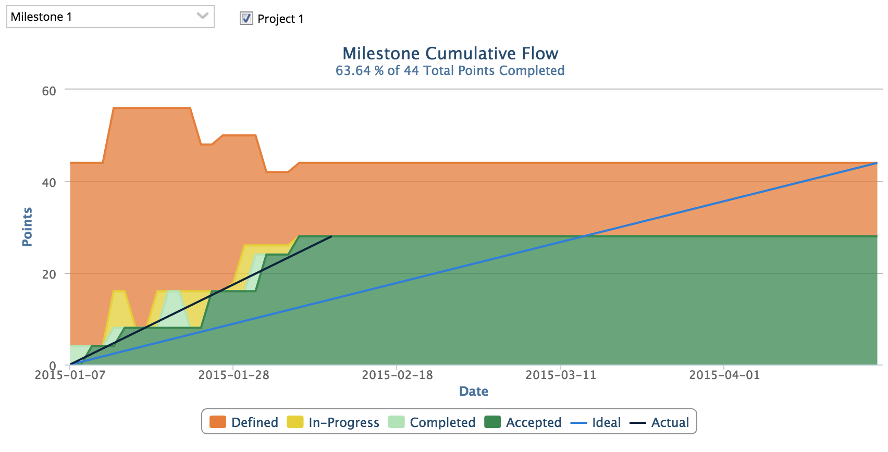

Milestone Cumulative Flow
=========================

## Overview

This app re-implements the Milestone Cumulative Flow chart available in the app catalog but with some added features:
* A milestone filter
* Checkboxes to include/exclude teams
* Ideal trend line
* Actual line

## License

This app is released under the MIT license.  See the file [LICENSE](./LICENSE) for the full text.

##Documentation for SDK

You can find the documentation on our help [site.](https://help.rallydev.com/apps/2.0/doc/)
